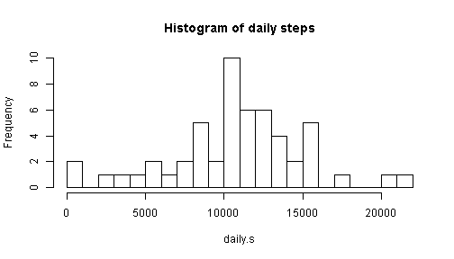
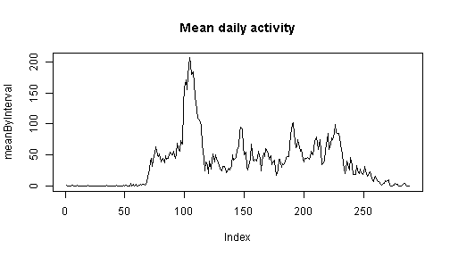
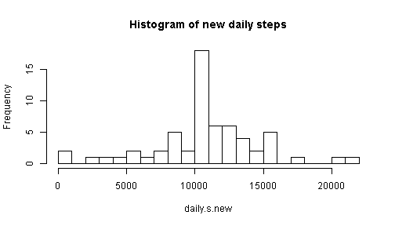
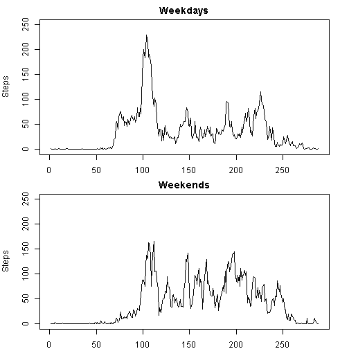

## Reproducible Research: Peer assessment 1   
===========================================
In this assignment we explore a file that details the number of steps that a person has made during a period of 61 days.  
The steps are detailed in intervals of 5 minutes during 24 hours of each day, that is 288 intervals in each day.  
The questions that we explore by given data are:  
    1. What is mean total number of steps taken per day?  
    2. What is the average daily activity pattern?  
    3. Can we devise a strategy for filling the missing data in the file, and what would be the influence of this action on the activity pattern?  
    4. Are there differences in activity patterns between weekdays and weekends?  
    
   We start by importing the data and looking into it to see how it is buit.  
   

```r
unzip("./Data/Reproducible research/repdata_data_activity.zip", 
      exdir = "./Data/Reproducible research")
stepping <- read.csv("./Data/Reproducible research/activity.csv")
file.remove("./Data/Reproducible research/activity.csv")    # This file is no longer needed.
```

```
## [1] TRUE
```

```r
head(stepping)
```

```
##   steps       date interval
## 1    NA 2012-10-01        0
## 2    NA 2012-10-01        5
## 3    NA 2012-10-01       10
## 4    NA 2012-10-01       15
## 5    NA 2012-10-01       20
## 6    NA 2012-10-01       25
```
There are 3 variables in the file:  
    1. The number of steps.  
    2. The date.  
    3. The interval, given as a numeric that represents the hour and minutes of the interval.  
We also see that some data is missing and coded as 'NA'.  
  
  
**1. EXPLORING THE DAILY NUMBER OF STEPS.**    

Our first step is to explore the daily number of steps.  
At this stage we will disregard the fact that some of the data is missing.  
For this we need to sum all the steps that belong to the same day, and perform this operation for all the days. This operation will be done by the function **tapply()**.  
When this is done we can plot a histogram of the daily steps. This histogram will be broken into 20 bins.  
    

```r
daily.s <- tapply(stepping$steps,stepping$date,sum)
hist(daily.s, breaks = 20, main="Histogram of daily steps")
```

 
Now we calculate the mean and the median of the daily steps. We are going to need these values later when we try to learn how the completion of the missing data infuences these values.  
In order to be able to make the calculation we need to remove all the NA's, however we don't make changes in the dataset yet.  


```r
mean.ds <- mean(daily.s, na.rm=T)
median.ds <- median(daily.s, na.rm=T)
```

**2. AVERAGE DAILY ACTIVITY.**

The next step will be to explore the average daily pattern of activity.  
To do this we separate the long data frame in such a way that each day will appear in a separate column, and the matching intervals of each day will appear in the same row.  
This operation will be done by the function **spread()**, and the spreading will be done according to the relevant 'date'.  
This function requires the package **'tidyr'**, and since, in a later step, we will need also the package **'dplyr'** we will load them both:  

```r
library(tidyr)
library(dplyr)
stepsByInterval <- spread(stepping, date, steps)
colnames(stepsByInterval)
```
When we check the column names of the data frame 'stepsByInterval' we see that its first column is the list of the intervals and the rest of the columns contain the daily activity which is our interest.  
Naturally, when we calculate the mean activity we will not include, in the calculation the first column, only the other columns. So, in the next coce column #1 is omitted from the calculation:  


```r
meanByInterval <- rowMeans(stepsByInterval[,-1], na.rm=T)
```
Now we can plot the daily activity (number of steps) as a function of the interval. We can also find the serial number of the interval which is most active on average, and the time of the day when this happens:  

```r
plot(meanByInterval, type="l", main="Mean daily activity")
```

 

```r
intMax <- which(meanByInterval == max(meanByInterval))
intMax
```

```
## 104 
## 104
```

```r
# Or in units of time:
timeMax <- stepsByInterval$interval[which(meanByInterval == 
                                              max(meanByInterval))]
timeMax # This corresponds to 08:35.
```

```
## [1] 835
```
We see that the maximal activity is early in the morning. Will it be the same on weekends ?  

**3. FILLING THE MISSING DATA.**

Next we proceed to take care of the missing data.  
This stage will include 4 steps:  
1. Check hou much data is missing.  
2. Fill each vacant place with the mean number of steps which is characteristic to this interval.  
3. Modify the new data frame to match, in form, to the original data frame 'stepping'.  
4. Creat a new histogram of the daily number of steps, calculate the new mean, and median of the daily number of steps and compare it with the original mean and median.  

First we check how much data is missing:  

```r
summary(stepping)
```

```
##      steps               date          interval   
##  Min.   :  0.0   2012-10-01:  288   Min.   :   0  
##  1st Qu.:  0.0   2012-10-02:  288   1st Qu.: 589  
##  Median :  0.0   2012-10-03:  288   Median :1178  
##  Mean   : 37.4   2012-10-04:  288   Mean   :1178  
##  3rd Qu.: 12.0   2012-10-05:  288   3rd Qu.:1766  
##  Max.   :806.0   2012-10-06:  288   Max.   :2355  
##  NA's   :2304    (Other)   :15840
```
So, 2304 entries are missing. This is quite a few from a total of approximately 17,500.  

The data frame to be completed is 'stepsByInterval'.  
To avoid using loops to complete the data we will calculate the full data frame as the sum of two matrices:  
The first, temp1, is the original data frame but with all the NA's replaced by zeros.  
The second, temp2, is a matching matrix full of zeros and only the vacant places of 'stepsByInterval' were filled with average values.  
Here is how it is done:  

```r
meanMat <- replicate(62, meanByInterval)
temp1 <- stepsByInterval
temp1[is.na(temp1)]<-0
temp2 <- meanMat
temp2[!is.na(stepsByInterval)] <- 0
filledStepsMat <- round(temp1 + temp2)
```
Two things should be noted:  
1. The number of steps is rounded so that the new data frame will contain only whole number of steps.  
2. The column of 'intervals' in included in the operation. Since it does not contain NA's it will remain the same. 

Now, that we have a full data frame we can convert its shape to match the original data set 'stepping'. To do this we will gather all the separate columns of steps into one long column, arranged by dates. A third column, of intervals will also be included. This operation will be done by the function **gather()**. Note that the interval column is excluded from the operation:  

```r
newDataSet<-gather(filledStepsMat, date, steps, -interval)
names(newDataSet)
```

```
## [1] "interval" "date"     "steps"
```
Note that the order of columns is different from the original order in 'stepping'.  
We will fix this by mutating new columns in the correct order (columns 4:6), and then getting rid of the old columns (columns 1:3). This is done by the function **mutate()** which is included in the **dplyr** package, which we have already loaded:  

```r
newDataSet <- mutate(newDataSet, a=steps, b=date, c=interval)[,4:6]
colnames(newDataSet) <- c("steps", "date", "interval")
```
Now 'newDataSet' matches 'stepping' exactly except for not containing NA's.  
The last step in this stage of the exploring will be to find out how the filling of the missing data has influenced the daily steps number.  
We will repeat the first part of the exploration with the new data set, that is, draw a new histogram, and find the relative difference between the old mean/median, and the new mean/median:   


```r
daily.s.new <- tapply(newDataSet$steps,newDataSet$date,sum)
hist(daily.s.new, breaks = 20, main="Histogram of new daily steps")
```

 

```r
mean.ds.new <- mean(daily.s.new, na.rm=T)
median.ds.new <- median(daily.s.new, na.rm=T)
dif.mean.ds <- round((mean.ds.new - mean.ds)/mean.ds.new, 4)
dif.median.ds <- round((median.ds.new - median.ds)/median.ds.new, 4)
dif.mean.ds
```

```
## [1] -1e-04
```

```r
dif.median.ds
```

```
## [1] -3e-04
```
Conclusions:  
1. The bin of the mean number of steps is much higher in the new data set. This is not surprising, as we have replaced more than 2000 NA's with average values.  
2. The values of the new mean, and new median have changed only by a slight amount. This is also not surprising, as only average values were added to the data set.  

**4. ACTIVITY ON WEEKDAYS VS. ACTIVITY ON WEEKENDS.**

In this section we will be looking for differences in activity patterns on weekdays and on weekends.  
The following steps will be taken:  
1. Copy the new data set to a new data frame.  
2. Use the function **weekdays()** to identify which date falls on which day of the week.  
3. Separate the data frame into two data frames: one for weekdays and one for weekends.  
4. Convert each data frame into a matrix of 288 lines (the number of intervals in each day), thus placing each day in a column of its own.  
5. Find the average number of steps in each interval, as we did in section #2, except now we do it separately for weekdays & weekends.  
6. Display the activities in 2 plots. Care must be taken to use the same limits on the y axes if we want to compare the two plots by their looks.  

Here is how this is done:   

```r
weekDataSet <- newDataSet
weekDataSet$date <- weekdays(as.Date(weekDataSet$date))
weSet <- weekDataSet[((weekDataSet$date == "Sunday") |
                         (weekDataSet$date == "Saturday")),]
wdSet <- weekDataSet[(weekDataSet$date != "Sunday") &
                         (weekDataSet$date != "Saturday"),]
wd <- matrix(wdSet$steps, nrow=288)
wd.MeanByInterval <- rowMeans(wd)
we <- matrix(weSet$steps, nrow=288)
we.MeanByInterval <- rowMeans(we)
par(mfrow = c(2, 1), mar = c(2,4,2,2))
plot(wd.MeanByInterval, type="l", main="Weekdays", 
     ylab="Steps", ylim=c(0, 250))
plot(we.MeanByInterval, type="l", main="Weekends", 
     ylab="Steps", ylim=c(0, 250))
```

 

Conclusions:  
1. The early morning activity is easier on weekends. (See intervals 70 to 100.)   
2. The morning rush hour is hardly noticeable on weekends.  
3. On the other hand, the rest of the day is more active on weekends.  

The last conclusion can be assessed by calculating the mean number of steps, for intervals 120 to 250, both for weekdays and weekends:  


```r
mean.wd <- round( mean(wd.MeanByInterval[120:250]));  # For weekdays
mean.we <- round( mean(we.MeanByInterval[120:250]));  # For weekends
```
We see that the mean number of step, after the morning rush hour, is **41** for weekdays, and **70** for weekends.  
So, at least for this person, the weekends are not a time of rest.  


